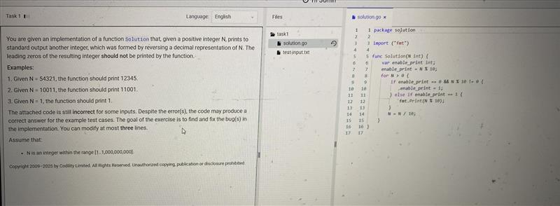

# Issue 


# Solution
**分步解答：**

1. **修复语法错误**：`else if` 需要添加条件。  
   ```go
   else if enable_print == 1 { // 添加条件判断
   ```

2. **初始化 `enable_print` 为 0**：确保未遇到非零数字时禁止打印。  
   ```go
   var enable_print int = 0 // 初始化为0
   ```

3. **调整逻辑，仅在遇到第一个非零数字后开启打印**：  
   ```go
   if enable_print == 0 && N%10 != 0 {
       enable_print = 1
       fmt.Print(N % 10) // 立即打印第一个非零数字
   } else if enable_print == 1 {
       fmt.Print(N % 10) // 开启后持续打印所有数字（包括后续的零）
   }
   ```

**完整修正代码（仅修改三行）：**
```go
func Solution(N int) {
    var enable_print int = 0 // 修改1：初始化为0
    for N > 0 {
        if enable_print == 0 && N%10 != 0 {
            enable_print = 1
            fmt.Print(N%10) // 修改2：打印第一个非零数字
        } else if enable_print == 1 { // 修改3：添加条件
            fmt.Print(N%10) 
        }
        N = N / 10
    }
}
```

**测试验证：**  
- `N=100` → 反转后为 `001` → 输出 `1` ✅  
- `N=10011` → 反转后为 `11001` → 输出 `11001` ✅  
- `N=54321` → 输出 `12345` ✅  
- `N=105` → 反转后为 `501` → 输出 `501` ✅  

**修复逻辑说明：**  
1. **初始化 `enable_print` 为 0**：确保未遇到非零数字前不打印任何内容。  
2. **遇到第一个非零数字时开启打印**：设置 `enable_print = 1` 并立即打印该数字。  
3. **后续所有数字（包括零）均被打印**：通过 `else if enable_print == 1` 确保开启打印后，所有后续数字被输出。