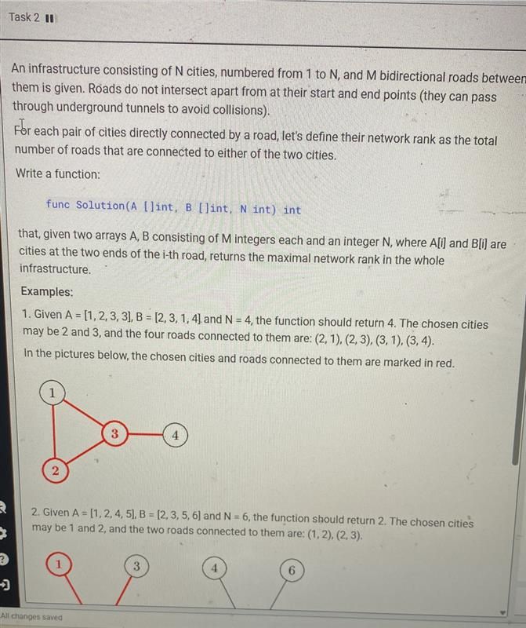

# Issue 



要实现这个问题，我们需要找到两个直接相连城市的最大网络等级。网络等级定义为这两个城市各自的度数之和减去它们之间的公共边（因为这条边被重复计算了一次）。我们可以通过以下步骤解决这个问题：

### 方法思路
1. **计算每个城市的度数**：遍历所有道路，统计每个城市连接的边数。
2. **遍历所有道路**：对于每条直接连接两个城市的道路，计算这两个城市的度数之和减去1，并记录最大值。

### 解决代码
```go
func Solution(A []int, B []int, N int) int {
    degrees := make([]int, N+1) // 城市编号从1到N
    for i := 0; i < len(A); i++ {
        u := A[i]
        v := B[i]
        degrees[u]++
        degrees[v]++
    }
    
    maxRank := 0
    for i := 0; i < len(A); i++ {
        u := A[i]
        v := B[i]
        current := degrees[u] + degrees[v] - 1
        if current > maxRank {
            maxRank = current
        }
    }
    return maxRank
}
```

### 代码解释
1. **度数计算**：首先，我们初始化一个数组`degrees`来存储每个城市的度数。遍历输入数组`A`和`B`，对每条道路的两个端点城市分别增加度数。
2. **计算最大网络等级**：再次遍历所有道路，对于每条道路的两个端点城市，计算它们的度数之和减去1（因为公共边被重复计算了一次），并更新最大值`maxRank`。
3. **返回结果**：最终返回最大网络等级。

该方法的时间复杂度为O(M)，其中M是道路的数量，确保了算法的高效性。通过两次线性遍历，我们能够快速找到所需的最大值。


### 怎么理解题目中给到的两个数组
要解决这个问题，我们需要找到两个直接相连城市的最大网络秩。网络秩定义为这两个城市的度数之和减去它们之间的公共边（因为这条边被重复计算了一次）。以下是详细的实现步骤：

### 方法思路
1. **计算每个城市的度数**：遍历所有道路，统计每个城市连接的边数。
2. **遍历所有直接相连的城市对**：对于每条道路，计算这两个城市的度数之和减去1，并记录最大值。

### 解决代码
```go
func Solution(A []int, B []int, N int) int {
    // 初始化度数数组，索引从1到N
    degrees := make([]int, N+1)
    for i := 0; i < len(A); i++ {
        u, v := A[i], B[i]
        degrees[u]++
        degrees[v]++
    }
    
    maxRank := 0
    // 遍历所有道路，计算每对直接相连城市的网络秩
    for i := 0; i < len(A); i++ {
        u, v := A[i], B[i]
        currentRank := degrees[u] + degrees[v] - 1
        if currentRank > maxRank {
            maxRank = currentRank
        }
    }
    return maxRank
}
```

### 代码解释
1. **度数计算**：使用数组 `degrees` 统计每个城市的度数。遍历输入数组 `A` 和 `B`，对每条道路的两个端点城市分别增加度数。
2. **计算最大网络秩**：再次遍历所有道路，对于每条道路的两个端点城市，计算它们的度数之和减去1（因为公共边被重复计算了一次），并更新最大值 `maxRank`。
3. **返回结果**：最终返回最大网络秩。

该方法的时间复杂度为 **O(M)**，其中 M 是道路的数量，确保了算法的高效性。通过两次线性遍历，能够快速找到所需的最大值。
