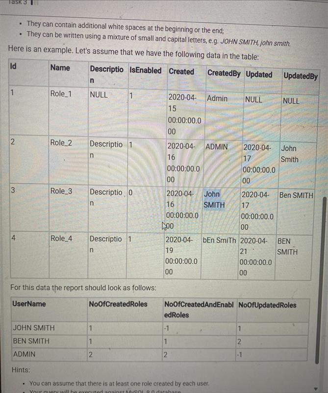
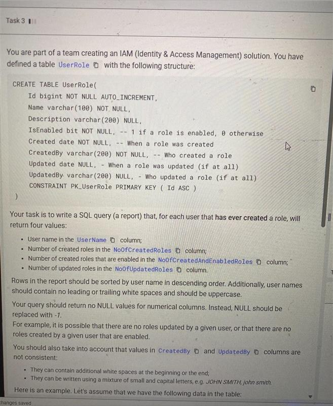

## Issue



## Solution
```sql
SELECT 
    C.UserName,
    C.NoOfCreatedRoles,
    C.NoOfCreatedAndEnabledRoles,
    COALESCE(U.NoOfUpdatedRoles, -1) AS NoOfUpdatedRoles
FROM (
    SELECT 
        TRIM(UPPER(CreatedBy)) AS UserName,
        COUNT(*) AS NoOfCreatedRoles,
        SUM(IsEnabled = 1) AS NoOfCreatedAndEnabledRoles
    FROM UserRole
    GROUP BY TRIM(UPPER(CreatedBy))
) AS C
LEFT JOIN (
    SELECT 
        TRIM(UPPER(UpdatedBy)) AS UserName,
        COUNT(*) AS NoOfUpdatedRoles
    FROM UserRole
    WHERE UpdatedBy IS NOT NULL
    GROUP BY TRIM(UPPER(UpdatedBy))
) AS U ON C.UserName = U.UserName
ORDER BY C.UserName DESC;
```